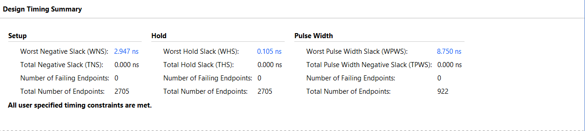
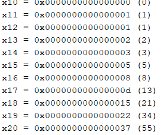

# Synthesizable 64-bit 5-Stage Pipelined RV64I Processor Core

An industry-standard, synthesizable 64-bit 5-stage pipelined RISC-V (RV64I) processor core designed in Verilog HDL (IEEE 1364-2001). The architecture is fully optimized for FPGA synthesis and implementation on Xilinx Artix-7 devices (`xc7a100tcsg324-1`). It features 3-way RAW data forwarding, load-use hazard mitigation, word-addressed single-port memory primitives, integrated hardware performance counters, and verified static timing closure at 50 MHz (**Worst Negative Slack: +2.947 ns**).

---

## Technical Specifications

| Parameter | Specification |
| :--- | :--- |
| **ISA Architecture** | RISC-V RV64I Base Integer Instruction Set |
| **Pipeline Stages** | 5 Stages: Instruction Fetch (IF), Instruction Decode (ID), Execute (EX), Memory Access (MEM), Write-Back (WB) |
| **Data Path Width** | 64-bit Data Path / 32-bit Instruction Length |
| **Target Device** | Xilinx Artix-7 FPGA (`xc7a100tcsg324-1` / Nexys A7-100T) |
| **Target Clock Frequency** | 50 MHz (20.0 ns Period Constraint) |
| **Achievable Operating Frequency** | ~58.64 MHz (20.0 ns - 2.947 ns WNS) |
| **Worst Negative Slack (WNS)** | **+2.947 ns** (Setup Timing Constraint Met) |
| **Worst Hold Slack (WHS)** | **+0.105 ns** (Hold Timing Constraint Met) |
| **Measured CPI** | **1.24** (Fibonacci Benchmark Execution) |
| **Total On-Chip Power** | 0.117 W (Dynamic: 0.024 W, Static: 0.093 W) |

---


### Key Design Implementation Details

1. **Hazard Detection and RAW Data Forwarding Unit**:
   - **3-Way Data Forwarding**: Resolves Read-After-Write (RAW) data dependencies directly from `EX/MEM` and `MEM/WB` pipeline stages to `EX` stage operands without stalling.
   - **Direct Load-After-Store Forwarding**: Forwards memory write data from `MEM/WB` directly to `EX/MEM` to resolve back-to-back `sd`/`ld` hazards.
   - **Load-Use Hazard Mitigation**: Injects control bubbles into `ID/EX` registers while stalling `PC` and `IF/ID` registers for 1 clock cycle upon detecting load-use conflicts.

2. **Branch and Control Flow Architecture**:
   - **Branch Target Calculation**: Evaluated during the `EX` stage using dedicated adders.
   - **Pipeline Flushing**: Flushes speculative instructions in `IF/ID` and `ID/EX` stages upon branch misprediction (branch taken), incurring a 1-cycle latency penalty.

3. **Memory Subsystem Optimization**:
   - **Instruction Memory**: 4KB byte-addressed memory initialized via Big-Endian pre-loader and synthesizable `$readmemh` primitives.
   - **Data Memory**: Word-addressed single-port memory (128 words × 64 bits = 1KB) using Distributed LUTRAM with combinational read and synchronous single-port write. Eliminates multi-port write memory bottlenecks and guarantees clean BRAM/LUTRAM synthesis.

4. **Hardware Performance Monitoring Unit (PMU)**:
   - Tracks active clock cycles, retired instructions, load-use stall cycles, and branch flush events in hardware registers to calculate real-time CPI metrics.

---

## Synthesis and Implementation Analysis

Synthesis and static timing analysis (STA) were performed using Xilinx Vivado 2022.1 targeting the Artix-7 `xc7a100tcsg324-1` FPGA.

### Static Timing Summary

- **Target Period**: `20.000 ns` (50 MHz)
- **Setup Slack (WNS)**: `+2.947 ns` (Passing)
- **Hold Slack (WHS)**: `+0.105 ns` (Passing)
- **Pulse Width Slack (WPWS)**: `+8.750 ns` (Passing)
- **Failing Endpoints**: `0` out of 2,705 Total Endpoints

---

## Verification and Benchmark Execution

Functional verification was conducted by running an iterative Fibonacci benchmark program. The algorithm generates 10 Fibonacci numbers, writes them to Data Memory using store doubleword (`sd`), loads them back into registers `x10` through `x19` using load doubleword (`ld`), and computes `x20 = x18 + x19`.

### Register File State After Execution

| Register | Hexadecimal Value | Decimal Equivalent | Description | Result |
| :--- | :--- | :--- | :--- | :---: |
| `x10` | `0x0000000000000000` | 0 | Loaded `fib(0)` from Data Memory | Pass |
| `x11` | `0x0000000000000001` | 1 | Loaded `fib(1)` from Data Memory | Pass |
| `x12` | `0x0000000000000001` | 1 | Loaded `fib(2)` from Data Memory | Pass |
| `x13` | `0x0000000000000002` | 2 | Loaded `fib(3)` from Data Memory | Pass |
| `x14` | `0x0000000000000003` | 3 | Loaded `fib(4)` from Data Memory | Pass |
| `x15` | `0x0000000000000005` | 5 | Loaded `fib(5)` from Data Memory | Pass |
| `x16` | `0x0000000000000008` | 8 | Loaded `fib(6)` from Data Memory | Pass |
| `x17` | `0x000000000000000d` | 13 | Loaded `fib(7)` from Data Memory | Pass |
| `x18` | `0x0000000000000015` | 21 | Loaded `fib(8)` from Data Memory | Pass |
| `x19` | `0x0000000000000022` | 34 | Loaded `fib(9)` from Data Memory | Pass |
| `x20` | `0x0000000000000037` | 55 | Computed `fib(8) + fib(9)` | Pass |

---

## Verification Artifacts and Proofs

### Behavioral Simulation Waveform (XSim)


### Design Static Timing Summary


### Simulation Execution Log & Register Dump


---

## Directory Structure

```
.
├── constraints/
│   └── rv64i_artix7.xdc            # 50 MHz Timing Constraints File (20.0 ns Period)
├── results/
│   ├── waveform ss.png             # XSim Behavioral Waveform Verification
│   ├── timing.png                  # Vivado Static Timing Summary
│   ├── result_fibo.png             # Simulation Console Log & Register Dump
│   ├── counter_results.png         # Hardware Performance Counter Summary
│   └── power.png                   # Vivado On-Chip Power Analysis
├── rtl/
│   ├── rv64i_core_top.v            # Top-Level Core Integration Module
│   ├── pc.v                        # Program Counter Register
│   ├── Instruction_Memory.v        # 4KB Instruction Memory Subsystem
│   ├── Data_Memory.v               # 64-bit Word-Addressed Data Memory
│   ├── register_file.v             # 32x64-bit Register File
│   ├── Immediate_Generation.v      # Immediate Generation Decoder
│   ├── control.v                   # Main Control Unit Decoder
│   ├── alu_control.v               # ALU Operation Control Unit
│   ├── alu.v                       # 64-bit Arithmetic Logic Unit
│   ├── hazard_detection.v          # Hazard Detection & Stall Generator
│   ├── forwarding_unit.v           # RAW Data Forwarding Unit
│   ├── ld_after_sd_forwarding.v    # Load-After-Store Data Forwarding Unit
│   ├── control_bubble.v            # Control Bubble Injection Mux
│   ├── IF_ID.v                     # IF/ID Pipeline Register
│   ├── ID_EX.v                     # ID/EX Pipeline Register
│   ├── EX_MEM.v                    # EX/MEM Pipeline Register
│   ├── MEM_WB.v                    # MEM/WB Pipeline Register
│   ├── perf_counters.v             # Hardware Performance Counter Unit
│   └── instructions.txt            # Pre-compiled Machine Code Binary Bytes
├── scripts/
│   └── run_vivado_flow.tcl         # Automated Vivado Batch Flow Script
├── tb/
│   ├── tb_rv64i_core.v             # Behavioral Simulation Testbench
│   ├── fibonacci_program_listing.txt# Assembly Code and Hex Machine Code Reference
│   └── instructions.txt            # Simulation Machine Code Binary Bytes
├── tools/
│   └── assembler.py                # Python RISC-V Assembler Utility
├── .gitignore                      # Git Exclusion Configuration
└── README.md                       # Repository Documentation
```

---

## Build and Execution Guidelines

### Running Simulation and Synthesis via Vivado GUI

1. Open **Xilinx Vivado**.
2. Select **Create Project** and specify project target device `xc7a100tcsg324-1`.
3. Add all Verilog HDL files in `rtl/` as **Design Sources**.
4. Add `tb/tb_rv64i_core.v` and `tb/instructions.txt` as **Simulation Sources**.
5. Add `constraints/rv64i_artix7.xdc` as **Constraints**.
6. Execute Simulation: Navigate to **Flow Navigator** -> **Run Simulation** -> **Run Behavioral Simulation**.
7. Execute Synthesis & Implementation: Click **Run Implementation**.

### Running Automated Batch Flow via TCL Console

In Vivado Command Prompt or TCL Console:
```bash
vivado -mode batch -source scripts/run_vivado_flow.tcl
```

---

## Python Assembler Tool

A custom Python script is included to compile RISC-V assembly programs into hex machine code bytes compatible with Instruction Memory initialization:

```bash
python tools/assembler.py program.s -o rtl/instructions.txt
```

---

## License

This project is licensed under the MIT License.

## Author

Ujjawal Khatri
and 
Molik Rajvanshi 
